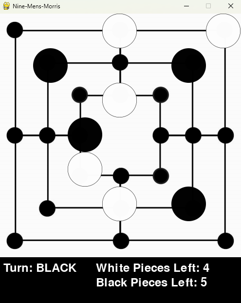

# Nine-Mens-Morris

**Screen shot of game running**



## Running the Project

**1. Create a Virtual Environment (Recommended but not necessary):**

A virtual environment isolates project dependencies from your system's Python environment, preventing conflicts.

**Steps:**

- **Open a terminal window.** I opened a terminal in my IDE
- **Navigate to the project directory.** 
- **Create a virtual environment named `venv`:**
```bash
   python -m venv venv
   ```

**2. Activate virtual Environment**
  - On windows
  ```bash
   venv/Scripts/activate
   ```
  - On Mac
  ```bash
   source venv/bin/activate
   ```
**3. Install dependencies**
  ```bash
   pip install -r requirements.txt
   ```
**4. Run the program**
  ```bash
   pip install -e .
  ```
  ```bash
   startgame
   ```
   - Run both of these commands at top project directory

#### Additonal notes:
- The app entry point is `backend/GameGUI.main`
  - The `setup.py` file defines this 


## Running the tests in Visual Studio Code

**1. Make sure the Python extension is installed**

**2. Run pytests discovery command to discover and run all unit tests**
  ```bash
   pytest tests/
  ```

**3. Configure Testing in the sidebar**
 - Select to use `pytest`, not `unittest`
 - Select test naming option for `'test_*.py'`
 - Not sure if this is necessary for people using VSCode since the .vscode file is included in the repo

**3. When writing new tests always put 'test_' at the front of every file name and test method name**
 - This is how pytest will find the test
